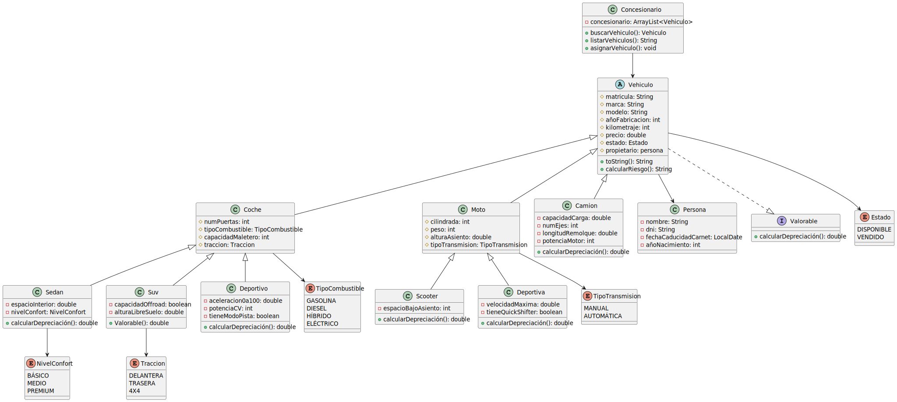

# UT5_ED_Prog

## Checklist de tareas
- [x] Crear repositorio de github
- [x] Añadir README.md
- [x] Crear carpeta uml y fichero puml
- [x] Modelar estructura inicial del diagrama
- [x] Primer commit con estructura básica
- [x] Modelado completo del diagrama
- [x] Generación del archivo diagrama.svg
- [x] Añadir svg al README.md

